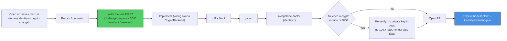

# Contributing to capauth

Thanks for helping with `capauth` — the **sovereign PGP identity** layer of SKWorld
(PGP keypair you hold → challenge-response → DID → the canonical agent-identity
resolver). This is **cryptographic identity infrastructure** the whole stack trusts,
so the bar is higher than a typical package: the honest-claim rules are
**non-negotiable** and the identity invariants are gated.

By participating you agree to the [Code of Conduct](CODE_OF_CONDUCT.md). All
contributions are licensed under **GPL-3.0-or-later** (this repo's recorded license —
not relicensed).

---

## Ground rules (read before you write code)

From the sk-standards
[CRYPTOGRAPHY_STANDARD](https://github.com/smilinTux/sk-standards), enforced in review:

1. **We bind vetted crypto; we never hand-roll primitives.** OpenPGP / lattice / curve
   math comes from **PGPy**, **GnuPG**, and **Sequoia (`sq`)** behind the
   `CryptoBackend` ABC (`crypto/base.py`). Do not hand-roll signatures, KEMs, or
   curves.
2. **The private key never leaves the machine — and never enters a document.** DID
   generators read **only** `public_key_armor`. No private key in a DID, profile
   export, registry entry, or log. (Tested invariant — keep it green.)
3. **No metadata leaks in published identity.** Tier-2/3 DID docs strip Tailscale
   `100.x` IPs and `memory`/`journal`/detailed `soul` fields; tier-3 honours
   `publish_to_skworld: false`.
4. **PQC migration is additive + reversible.** Never remove a classical key while
   interop is in flux. New algorithms are **additive** suite-ids on the
   `models.Algorithm` enum (agility per NIST CSWP 39). GnuPG is signing-disqualified
   for PQC — only the Sequoia backend hosts a PQC signing root.
5. **No claim without a test.** Every identity/crypto behaviour is backed by a test;
   the `skcapstone doctor` `identity:*` checks must stay green.

### Claim-language discipline (hard rule)

In code, comments, docstrings, docs, **and commit messages**:

- ✅ Say **"quantum-resistant" / "post-quantum."**
- ❌ Never say **"quantum-proof," "quantum-safe," "unbreakable,"** or **"CNSA 2.0
  compliant."**
- Every claim cites **surface + FIPS/RFC number + hybrid-vs-classical**.
- The **live root is classical** — never describe a classical surface as
  quantum-resistant. capauth is **signature/identity, not a KEM** — never imply it
  defends Harvest-Now-Decrypt-Later or establishes session secrets.
- The **experimental / unaudited** banner stays in README, SOP, and SECURITY until a
  real third-party audit lands.

Reviewers will block a PR that introduces a forbidden word or an over-claim, even in a
comment.

---

## Development workflow



### Setup

```bash
git clone https://github.com/smilinTux/capauth
cd capauth
python -m venv .venv && . .venv/bin/activate
pip install -e ".[all]"
pytest && ruff check . && black --check .
```

For the **PQC signing** path, install Sequoia `sq` built with the PQC feature (see
project memory `sequoia-pqc-backend-build`) and select the `sequoia` backend.

---

## What a good PR looks like

- **Scoped.** One logical change; crypto/identity-surface changes discussed in an
  issue first.
- **Tested.** New behaviour has a test; bug fixes add a regression test that fails
  before and passes after; `skcapstone doctor` identity checks stay green.
- **Honest.** No new claim exceeds the evidence; no forbidden words; classical
  surfaces are not described as quantum-resistant; the unaudited banner intact.
- **Documented.** README / SOP / CHANGELOG / docs updated when behaviour or interop
  changes.

### Out of scope (by design)

- A **second** hand-written crypto primitive, or replacing a bound OpenPGP library
  with home-grown math.
- Making `capauth` a KEM / transport / authorization server / secret store for other
  services.
- Removing classical keys before the gated root-rotation ceremony.

---

## Commits

- **Conventional, imperative subject lines** (`fix:`, `feat:`, `test:`, `docs:`).
  Reference the issue; isolate crypto/identity changes from refactors.
- **Honest-claim discipline applies to commit messages too.**
- When a contribution is co-authored by an AI agent, end the commit with the trailer:

  ```
  Co-Authored-By: Claude Opus 4.8 <noreply@anthropic.com>
  ```

  (Credit every co-author with a `Co-Authored-By:` trailer.)

---

## Reporting security issues

**Do not** open a public issue for a vulnerability. Follow [SECURITY.md](SECURITY.md)
(private GitHub Security Advisory or maintainer email, coordinated disclosure).

Thanks for keeping identity sovereign and the crypto honest. 🐧 **SK =
staycuriousANDkeepsmilin**
