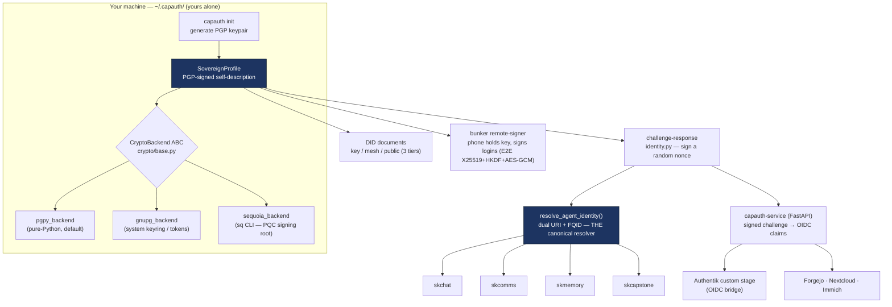
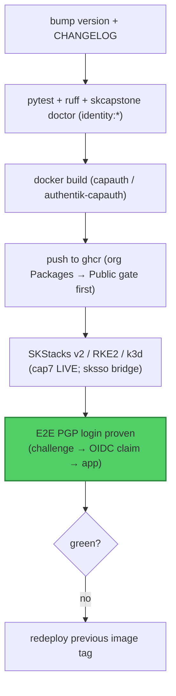

# capauth — Standard Operating Procedures

`capauth` is the **sovereign PGP identity** capability of SKWorld: every entity
(human or AI) is rooted in a PGP keypair *it* holds, proves itself by signing a
random challenge (offline-verifiable, no auth server), publishes **W3C DID**
documents at three privacy tiers, and is the **single canonical agent-identity
resolver** the rest of the stack delegates to. It ships as a Python library + a
`capauth` CLI + a FastAPI verification service (PGP-SSO / OIDC bridge).

**Maturity tier:** **T0 today** — the live sovereign root and the agent
signing / DID / challenge-response / key-wrap keys are **classical** Ed25519 /
RSA-4096 (RFC 8032 / 4880), therefore **Shor-breakable** once a CRQC exists.
capauth is a **signature / identity** layer (not a KEM), so signatures are **not**
retroactively breakable and Harvest-Now-Decrypt-Later does **not** apply to it —
migration is real but deferrable. The **T3 hybrid-signature path is additive and
proven**: the Sequoia (`sq`) PQC OpenPGP signing backend (`crypto/sequoia_backend.py`)
issues **ML-DSA-87 + Ed448** (FIPS 204, NIST L5) / **ML-KEM-1024 + X448** (FIPS 203)
composite keys on OpenPGP v6 (RFC 9580 / draft-ietf-openpgp-pqc-17) and has been
verified end-to-end through capauth, but the **live root stays classical until the
gated root-rotation ceremony**. Migration tracked under epic `PQC-MIGRATION`
(coord `e1d6ba2a`). Per-surface inventory: [docs/CRYPTO_SPEC.md](docs/CRYPTO_SPEC.md).

**CRYPTOGRAPHY_STANDARD compliance:** capauth conforms to the sk-standards
[CRYPTOGRAPHY_STANDARD](https://github.com/smilinTux/sk-standards) — algorithm
agility via the `models.Algorithm` enum (additive suite-ids per NIST CSWP 39), a
`CryptoBackend` ABC (`crypto/base.py`) with vetted backends (PGPy / GnuPG /
Sequoia — **no hand-rolled primitives**), honest surface-scoped claims, and the
**hybrid combiner is `HKDF(X25519_ss ‖ MLKEM768_ss)` — never XOR, never pure-PQ**
(the ML-KEM-768 + X25519 key-wrap target). Live primitives are reportable via the
ecosystem self-report (`sksecurity status`) and `capauth did identity-card`.

**Standards anchored:** RFC 4880 / RFC 9580 (OpenPGP), RFC 7748 (X25519), RFC 8032
(Ed25519), FIPS 203 (ML-KEM), FIPS 204 (ML-DSA), FIPS 205 (SLH-DSA), W3C DID-core,
OIDC, NIST CSWP 39 (crypto-agility). **License:** GPL-3.0-or-later (legacy —
recorded, not relicensed). **Python:** ≥ 3.11.

---

## 1. Overview

**What capauth owns:**

- The **sovereign profile** — a PGP-rooted identity at `~/.capauth/`, yours alone.
- **Challenge-response** — prove identity by signing a random nonce; verifiable
  offline by anyone holding the public key, with **zero phone-home**.
- **DID (three tiers)** — `did:key` (zero-infra), `did:web` mesh (Tailscale-private),
  `did:web` public (skworld.io).
- The **single canonical agent-identity resolver** (`resolve_agent_identity()`,
  dual URI `capauth:<a>@skworld.io` + FQID `<a>@<op>.<realm>`) that skchat, skcomms,
  skmemory, and skcapstone delegate to instead of reimplementing identity.
- The **verification service** — FastAPI app that turns a signed challenge into OIDC
  claims (passwordless PGP login for any OIDC app: Forgejo, Nextcloud, Immich), plus
  the **Authentik custom stage** and the **bunker remote-signer** (phone holds the
  key and signs logins).
- **Peer mesh, PMA membership, org registry.**

**What capauth explicitly does NOT do:**

- It is **not a KEM/transport** — it authenticates, it does not establish bulk
  session secrets (that is `sk_pqc` / TLS). HNDL is out of its threat surface.
- It does **not** ship a post-quantum *live root* yet — the proven PQC backend is
  available but the live root is classical until the gated ceremony.
- It does **not** store other services' secrets, run an authorization server, or
  phone home for verification.

---

## 2. Architecture

### Identity lifecycle + delegation



### Challenge-response (the auth primitive)

```mermaid
sequenceDiagram
    autonumber
    participant V as Verifier
    participant P as Prover (holds private key)
    V->>P: challenge = random nonce (create_challenge)
    P->>P: respond_to_challenge(nonce, passphrase)<br/>detached PGP signature over the nonce
    P-->>V: ChallengeResponse (signature + claimed pubkey/fp)
    V->>V: verify_challenge(nonce, signature, public_key)
    Note over V: valid signature == authenticated.<br/>No middleman ever sees the secret; works offline.
```

Bind-mounts / data: identity lives at `~/.capauth/`; DID tiers write
`~/.skcapstone/did/key.json` (T1), `~/.skcomms/well-known/did.json` (T2, Tailscale
Serve), and Cloudflare KV (T3). The verification service exposes HTTP (port per
deploy). Source map + full flows: [docs/ARCHITECTURE.md](docs/ARCHITECTURE.md).

---

## 3. Build

`capauth` is a Python package (library + `capauth` CLI + `capauth-service`), plus a
container image (`Dockerfile`) and the Authentik-custom image
(`Dockerfile.authentik-capauth`).

```bash
pip install -e ".[all]"          # into the ~/.skenv venv (see skcapstone)
# build the wheel/sdist:
python -m pip install --upgrade build && python -m build
# container:
docker build -t capauth .
# Authentik-custom (PGP stage baked in) — see docs/authentik-capauth.md:
docker build -f Dockerfile.authentik-capauth -t authentik-capauth .
```

Backends: `pgpy` (default, no system deps); `gnupg` needs system `gpg2`; the
**PQC signing** backend needs the `sq` CLI (Sequoia, built with the PQC feature —
see project memory `sequoia-pqc-backend-build`).

---

## 4. Test

```bash
pytest                           # tests/ — identity, did, profile, resolver, service, pqc
ruff check . && black --check .
```

| Suite | Covers |
|---|---|
| `tests/test_identity*` | challenge-response sign/verify round-trip + tamper rejection |
| `tests/test_did*` | three-tier DID generation; private-key-never-touched invariant; no Tailscale `100.x` IP leaks; tier-3 `publish_to_skworld` gate |
| `tests/` resolver | `resolve_agent_identity()` dual-URI / FQID; operator-vs-agent; no `@capauth.local` placeholders (locked by `skcapstone doctor` `identity:*`) |
| `tests/` pqc | PQC root works **end-to-end** through capauth (Sequoia v6 composite); honest PQC representation for v6 roots (no false RSA label) |
| `tests/` service | signed challenge → OIDC claims; Authentik stage flow |

The green-bar gate that blocks release: all of the above plus the
`skcapstone doctor` identity invariants.

---

## 5. Release / Deploy

**Library:** bump `version` in `pyproject.toml`, add a `CHANGELOG.md` entry, run the
test gate, `python -m build`, tag `vX.Y.Z`, push.

**Verification service / Authentik bridge (deploy):**



The Authentik-custom image has four known build/migrate gotchas (imghdr/py3.14,
2-step flow state, enroll-before-verify, `lifecycle.migrate` override + worker
required for blueprints) — see [docs/authentik-capauth.md](docs/authentik-capauth.md).

**The root-rotation ceremony** (classical → PQC live root) is a **gated, owner-only**
deploy with Chef's real key — see [docs/ROOT_ROTATION_CEREMONY.md](docs/ROOT_ROTATION_CEREMONY.md)
and [docs/PQC_ROOT_MIGRATION.md](docs/PQC_ROOT_MIGRATION.md). It is additive and
reversible; classical keys are not removed while interop is in flux.

### Front-end / Exposure

Per [sk-standards `UNIFIED_INGRESS_STANDARD.md`](https://github.com/smilinTux/sk-standards/blob/main/standards/UNIFIED_INGRESS_STANDARD.md):

- **Tier:** `2 SKStacks/Traefik`. The PGP-SSO bridge (`authentik-capauth` + the
  `capauth-service` OIDC IdP, `src/capauth/service/app.py`) runs as cluster workloads on
  SKStacks v2 / RKE2 / k3d (cap7 LIVE), Traefik label-routed, fronted by ONE
  **Cloudflare Tunnel** — the proven **sksso** pattern (`runbooks/sksso-cloudflared-*`).
- **Public `:443` route(s):**
  - SSO bridge at `capauth-skstack13.skworld.io` / `capauth-skstack41.skworld.io` —
    OIDC discovery `GET /.well-known/openid-configuration` + `GET /.well-known/jwks.json`,
    challenge `POST /capauth/v1/challenge`, verify `POST /capauth/v1/verify`,
    `GET /capauth/v1/status`, callback `GET /capauth/v1/callback`.
  - Bunker remote-signer relay (CF-Tunnel **or** Tailscale Funnel) —
    `POST /bunker/session`, `WS /bunker/ws`, and the phone PWA under `/bunker/`.
- **Bind address:** behind the tunnel `capauth-service` listens on `:8420` as a
  cluster-internal **ClusterIP** Service (Traefik is the only client). The standalone
  container's default `0.0.0.0:8420` (`service/server.py`) MUST be constrained to
  `127.0.0.1` / tailnet when not behind Traefik — **never an internet-exposed port**
  (the tunnel is the sole ingress).

---

## 6. Configuration / Usage

| Knob | Where | Effect |
|---|---|---|
| `~/.capauth/` | filesystem | the sovereign profile + keys (yours alone) |
| `~/.capauth/config.yaml` `publish_to_skworld` | config | gates tier-3 public DID publication |
| `--sync` / `capauth sync` | CLI | replicate the identity across Syncthing mesh nodes |
| `SK_STANDALONE=1` | env | force standalone (ignore skcapstone integration) |
| backend select | `get_backend("pgpy"\|"gnupg"\|"sequoia")` | choose crypto backend |
| `~/.skcapstone/cluster.json` | config | `realm` / `operator` for the FQID half of the resolver |

**Never inline a live secret.** Passphrases are prompted / sourced from the agent
unlock hook (gpg-agent / skvault); the private key never leaves the machine and is
never embedded in a DID document.

---

## 7. API / Reference

**CLI (selected):**

```bash
capauth init --name "Chef" --email "..."     # create sovereign profile (PGP keypair)
capauth profile show | verify                # display / verify signature integrity
capauth export-pubkey [-o file.asc]          # export ASCII-armored public key
capauth verify --pubkey peer.pub.asc         # challenge-response round-trip
capauth did generate --tier key|mesh|public  # W3C DID at the chosen privacy tier
capauth login <service_url>                  # passwordless PGP login (caches OIDC token)
capauth setup forgejo --capauth-url <url>    # generate Forgejo OIDC app.ini block
capauth mesh discover | peers | announce     # P2P peer mesh
capauth pma request | approve | verify       # PMA membership (Fiducia Communitatis)
capauth register --org smilintux --name ...  # register with a sovereign org
```

**Python:**

```python
from capauth import resolve_agent_identity, SovereignProfile
ident = resolve_agent_identity("lumina")     # None → active agent via SKAGENT
ident.capauth_uri   # 'capauth:lumina@skworld.io' (wire identity; always present)
ident.fqid          # 'lumina@chef.skworld'       (agent@operator.realm)
ident.fingerprint   # 40/64-char PGP fp (None if placeholder)
```

Full protocol + claim/token format: [docs/PROTOCOL.md](docs/PROTOCOL.md),
[docs/CLAIMS.md](docs/CLAIMS.md). Crypto detail: [docs/CRYPTO_SPEC.md](docs/CRYPTO_SPEC.md).

---

## 8. Troubleshooting

| Symptom | Likely cause | Fix |
|---|---|---|
| `capauth verify` fails on a valid peer | wrong public key / stale profile | re-`export-pubkey`; confirm fingerprint matches the DID/identity card |
| resolver returns `@capauth.local` placeholder | per-agent identity file missing | run `skcapstone doctor` → fix the `identity:*` checks; ensure `cluster.json` realm/operator |
| DID document leaks a `100.x` IP | tier mis-selected | tier-2/3 strip Tailscale IPs by design — regenerate with the correct `--tier`; never hand-edit |
| PQC signing unavailable | `sq` CLI missing or built without PQC | install Sequoia `sq` with the PQC feature (see `sequoia-pqc-backend-build`); select the `sequoia` backend |
| DID shows a false `RSA` label on a v6 root | stale algorithm mapping | update to the honest v6/64-hex fingerprint representation (fixed: commit `0609800`) |
| Authentik login loops / blueprint not applied | worker not running / `lifecycle.migrate` not overridden | see the four gotchas in [docs/authentik-capauth.md](docs/authentik-capauth.md) |
| login works but no OIDC token cached | service URL / claims mismatch | re-run `capauth login <url>`; check the verification service logs |

---

## 9. Maturity-tier + Version reference

- **Maturity tier:** **T0** live (classical Ed25519/RSA root + surfaces) with the
  **T3 hybrid-signature path additive + proven** (ML-DSA-87+Ed448 / ML-KEM-1024+X448,
  FIPS 204/203, RFC 9580 v6) via `sequoia_backend.py`; live root migrates under the
  gated ceremony. As a signature/identity layer, **HNDL does not apply** — migration
  is real but deferrable.
- **VERSION_LIFECYCLE phase:** Active (v2). **SemVer:** `0.2.3` (`pyproject.toml`).
- **CRYPTOGRAPHY_STANDARD compliance:** see the header line above — agility enum +
  backend ABC + honest surface-scoped claims + hybrid combiner
  `HKDF(X25519 ‖ MLKEM768)` (never XOR / never pure-PQ) + ecosystem self-report.
- **PQC migration:** epic `PQC-MIGRATION`, coord `e1d6ba2a`; master plan = skchat
  `docs/quantum-resistance-architecture.md`; standard = sk-standards
  `CRYPTOGRAPHY_STANDARD.md`.

---

**SK = staycuriousANDkeepsmilin 🐧** — *capauth: you are not a user, you are a sovereign.*
