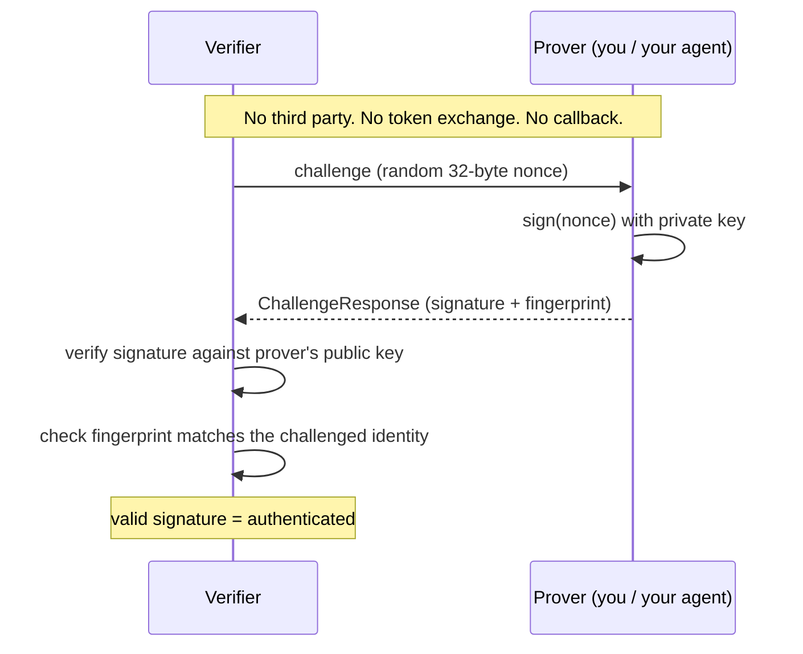
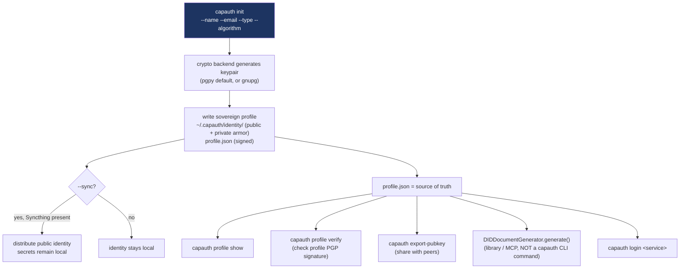
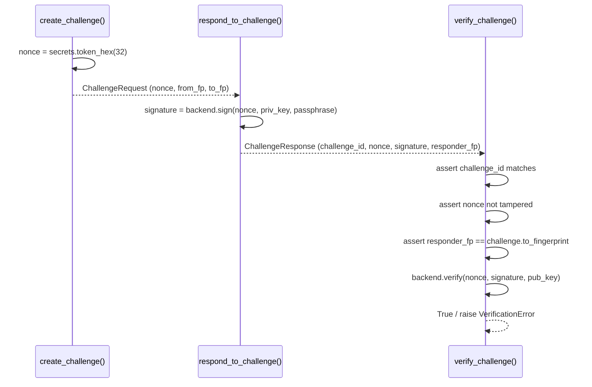
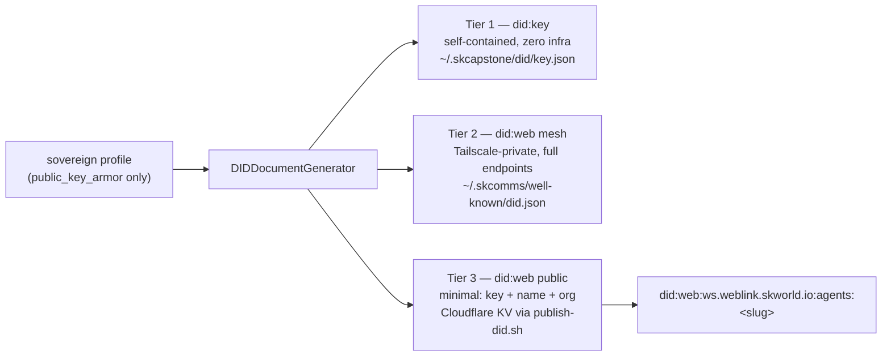
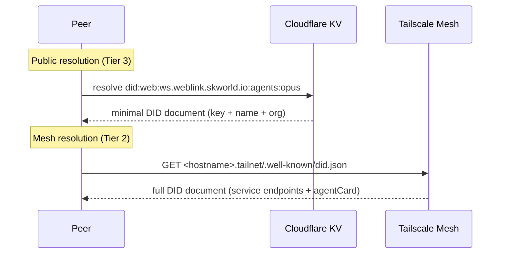
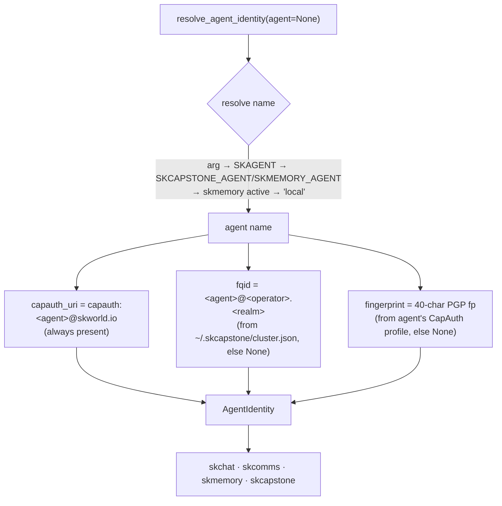
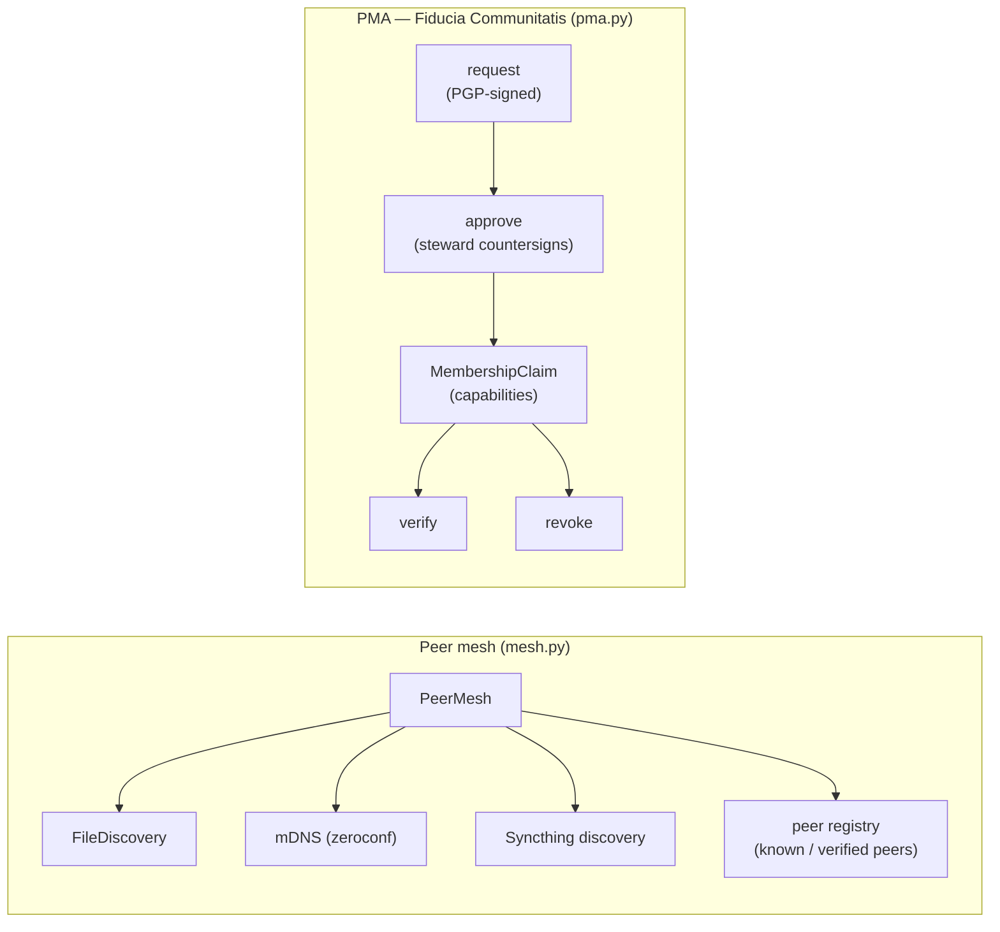
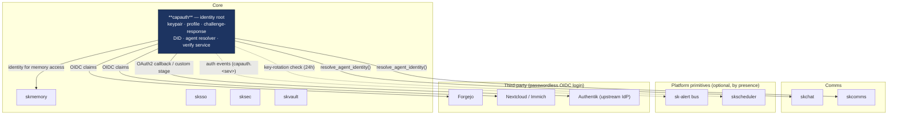

# capauth — Architecture

capauth is the **Core identity capability** of [SKWorld](https://skworld.io). Its
job is narrow and load-bearing: turn a PGP keypair into a self-hosted,
verifiable, sovereign identity that every other layer can trust without a
corporate authorization server in the loop.

This document walks the pieces — accessible first, precise underneath — with
mermaid diagrams for each key workflow, a source-map table, and where capauth
sits in the ecosystem.

---

## The one big idea

Everything in capauth reduces to one primitive: **sign a random challenge with a
private key only you hold; anyone with your public key can verify it offline.**



Everything else — DID documents, the login flow, the verification service, the
peer mesh, PMA membership — is built on top of this single proof.

---

## Identity lifecycle

A sovereign profile is created once and lives at `~/.capauth/` (override with
`--home` / `CAPAUTH_HOME`). It is the root from which DIDs, logins, and peer
proofs all derive.



**Key facts grounded in the code:**

- Two key algorithms: `ed25519` and `rsa4096` (default), chosen at `init`.
- Two crypto backends behind one interface (`crypto/base.py`):
  - `pgpy` — pure-Python, default; private key stored in the profile.
  - `gnupg` — uses the system GPG keyring, so hardware tokens (YubiKey,
    OpenPGP card) and system-managed keys work without importing the private
    key into capauth.
- `profile verify` re-checks the profile's own PGP signature — this is what the
  optional `skscheduler` job runs every 24h as a key-integrity heartbeat.

---

## Challenge-response verification

`identity.py` implements the core proof in three pure functions. `capauth verify`
exercises the full round-trip locally as a self-test/demo; the same functions
back the verification service and peer mesh.



The three invariants in `verify_challenge` — matching challenge ID, untampered
nonce content, and fingerprint binding — are what make a *replayed* or
*impersonated* response fail. A cloned agent that lacks the matching private key
cannot produce a valid signature, so it is rejected in milliseconds rather than
slipping through undetected.

---

## DID — three privacy tiers

capauth generates W3C-compliant DID documents at three tiers, so you pick the
right exposure for each context. The generator (`did.py`) reads **only** the
public key armor — the private key is never touched, and `memory`/`journal`/
detailed `soul` fields are never included.



| Tier | Method | Scope | Contents | Storage |
|------|--------|-------|----------|---------|
| **1** | `did:key` | Self-contained, zero infrastructure | Public key JWK only | `~/.skcapstone/did/key.json` |
| **2** | `did:web` (mesh) | Tailscale-private | Full service endpoints + `skworld:agentCard` | `~/.skcomms/well-known/did.json` (Tailscale Serve) |
| **3** | `did:web` (public) | Public internet | Minimal: key + name + entity_type + org | Cloudflare KV → `did:web:ws.weblink.skworld.io:agents:<slug>` |

**Security invariants (enforced in `did.py`):** `from_profile()` reads only the
public key; no Tailscale `100.x.x.x` IPs appear in any document (magic-DNS
hostname only); Tier 3 respects `publish_to_skworld: false` in
`~/.capauth/config.yaml`.

### Resolution



---

## Login & the OIDC bridge

`capauth login <service>` is the client side; the `capauth-service` FastAPI app is
the server side. Together they let **any OIDC-consuming app** (Forgejo, Nextcloud,
Immich, custom) accept a passwordless PGP login — the app never learns a secret,
it just gets standard OIDC claims back.

```mermaid
sequenceDiagram
    participant U as User / Agent
    participant CLI as capauth login
    participant SVC as capauth-service (FastAPI)
    participant APP as OIDC app (Forgejo)
    participant IDP as Authentik (optional upstream)

    U->>CLI: capauth login https://forgejo.local
    CLI->>SVC: POST /capauth/v1/challenge
    SVC-->>CLI: signed nonce
    CLI->>CLI: verify server nonce sig; sign nonce<br/>(system GPG, else PGPy) + sign claims bundle
    CLI->>SVC: POST /capauth/v1/verify (signature + claims)
    SVC->>SVC: verify signature, look up enrolled key
    SVC-->>CLI: OIDC tokens (cached at ~/.capauth/tokens/<host>/)
    Note over SVC,APP: App-facing OIDC discovery
    APP->>SVC: GET /.well-known/openid-configuration
    APP->>SVC: standard OIDC flow → claims (capauth_fingerprint, groups)
    SVC-->>IDP: optional OAuth2 callback to upstream Authentik
```

**Grounded details:**

- Signing priority in `login.py`: **system GPG keyring** (`gpg --detach-sign`)
  first — works with hardware tokens — falling back to the **PGPy** backend with
  the profile's private key.
- Tokens cache at `~/.capauth/tokens/<service_host>/tokens.json`.
- `--no-claims` authenticates anonymously (fingerprint only, no profile claims).
- Service endpoints (`service/app.py`): `/capauth/v1/{challenge,verify,status,keys}`
  plus an OAuth2 `/callback` to an upstream Authentik IdP. `capauth setup forgejo`
  emits the ready-to-paste `app.ini` OIDC block (uses `capauth_fingerprint` as the
  username claim and a `groups` claim for admin).
- The `authentik/` package provides a **custom Authentik stage** (claims mapper,
  nonce store, verifier) for deployments that front capauth with Authentik.

---

## The canonical agent-identity resolver

capauth owns the **single source of truth** for agent identity. Every SK package
(skchat, skcomms, skmemory, skcapstone) calls `resolve_agent_identity()` instead
of reimplementing identity logic. A resolved identity carries a **dual URI** that
bridges two namespaces.



- **`capauth_uri`** — `capauth:<agent>@skworld.io`, the wire identity used by the
  peer registry, bridge scripts, and skchat transport. Always derivable.
- **`fqid`** — `<agent>@<operator>.<realm>`, the skcomms three-tier sovereign
  address, read from `cluster.json`.
- **`fingerprint`** — only surfaced when a real CapAuth profile exists; placeholder
  identities are never returned.

The shared `~/.skcapstone/identity/identity.json` holds the **operator** identity;
each agent's wire identity resolves per-agent. `skcapstone doctor`'s `identity:*`
checks lock this invariant in.

---

## Peer mesh & PMA membership



- **Mesh** discovers peers over shared filesystem, mDNS, and Syncthing — no
  central server. Peers can be verified via the same challenge-response proof.
- **PMA** is the membership layer: a member submits a PGP-signed `request`, a
  steward `approve`s it (countersigning) to mint a `MembershipClaim` carrying
  capabilities; claims can be `verify`-ed and `revoke`-d. `capauth register`
  bundles profile + signed registry entry + PMA request in one step.

---

## Source map

| Module | Role |
|--------|------|
| `cli.py` | Click CLI entrypoint — `init`, `sync`, `profile show/verify`, `export-pubkey`, `verify`, `did`, `login`, `mesh`, `pma`, `register`, `setup`, `discover`, `peers` |
| `profile.py` | Sovereign profile init / load / export / sign-verify; `DEFAULT_CAPAUTH_DIR` |
| `identity.py` | PGP challenge-response: `create_challenge`, `respond_to_challenge`, `verify_challenge` |
| `models.py` | Pydantic models: `SovereignProfile`, `ChallengeRequest`, `ChallengeResponse`, `Algorithm`, `CryptoBackendType`, `EntityType` |
| `crypto/base.py` | Crypto backend interface (sign / verify / fingerprint / keygen) |
| `crypto/pgpy_backend.py` | Pure-Python PGP backend (default) |
| `crypto/gnupg_backend.py` | System GPG keyring backend (hardware tokens) |
| `did.py` | `DIDDocumentGenerator`, `DIDTier`, `DIDContext` — all three tier generators; public-key-only invariant |
| `agent_identity.py` | `resolve_agent_identity`, `AgentIdentity` — the canonical dual-URI resolver |
| `login.py` | `do_login()` — client-side login flow (challenge → sign → verify → token cache) |
| `service/app.py` | FastAPI verification service — `/capauth/v1/{challenge,verify,status,keys}`, OIDC discovery, OAuth2 callback |
| `service/server.py` | `capauth-service` runner / entrypoint |
| `service/keystore.py` | Enrolled-key store (approve / revoke) |
| `authentik/` | Authentik custom stage — `stage.py`, `claims_mapper.py`, `nonce_store.py`, `verifier.py`, `api.py` |
| `mesh.py` | `PeerMesh` — peer discovery aggregation + registry |
| `discovery/` | Discovery backends — `file_discovery.py`, `mdns.py`, `syncthing.py` |
| `pma.py` | PMA membership — request / approve / verify / revoke, `MembershipClaim` |
| `registry.py` | `RegistryEntry`, sovereign org registry, `build_capauth_uri` |
| `sync.py` | Syncthing public-identity distribution with secret exclusions |
| `estate.py` | Estate manifest, alternate-home/keyring discovery, retirement gate, evidence |
| `integration.py` | skcapstone adapter — `alert()` (sk-alert), `ensure_schedule()` (skscheduler), `register_self()`; default-on-by-presence |
| `apps.py` | App/service descriptor helpers |
| `integrations/forgejo/` | Forgejo OIDC provider + auth flow + config generator |
| `migrations/` | Service DB migrations (`0001_initial.py`) |

---

## Where capauth lives in the ecosystem



capauth is the cryptographic floor of the silicon→soul vertical: every layer
above trusts you because capauth proves who you are — a keypair you generated,
on hardware you own, signed by nobody's permission but yours.

---

Part of the **[SKWorld](https://skworld.io)** sovereign ecosystem · 🐧 smilinTux
